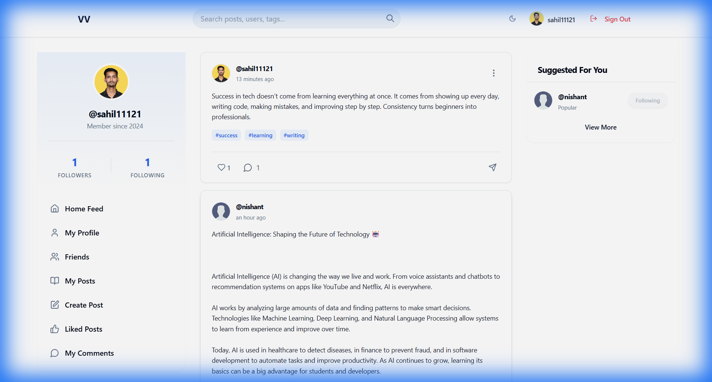
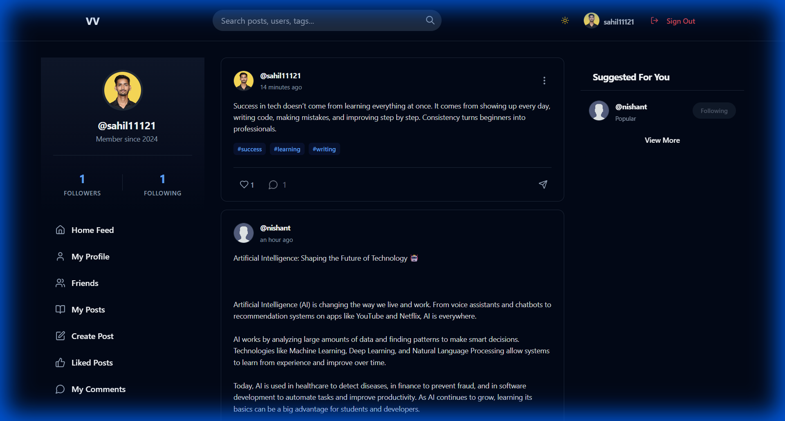
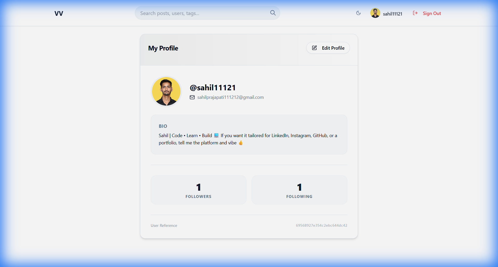
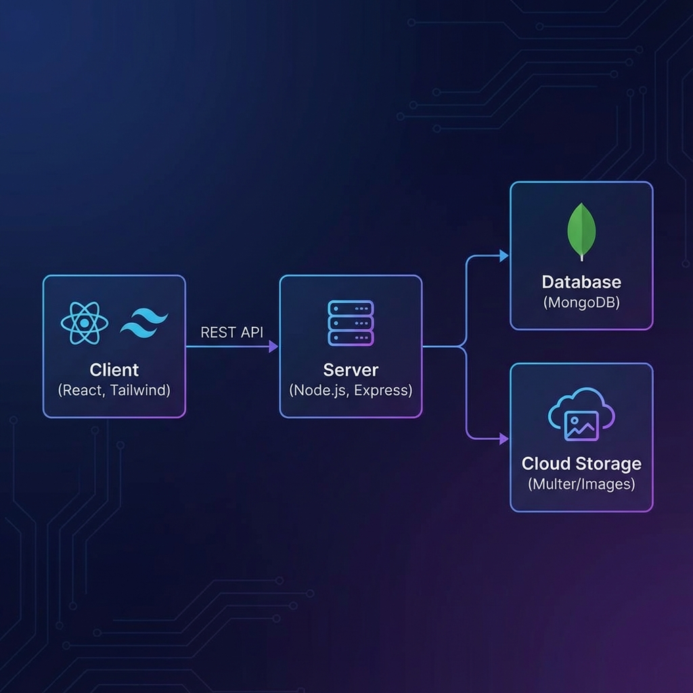

# VibeVerse - Core Documentation

Welcome to the official documentation for **VibeVerse**, a premium MERN stack social media platform designed for seamless interaction, vibrant content sharing, and a personalized user experience.

---

## 📸 Application Preview (Real UI)

### Home Feed (Light & Dark)
| Light Mode Dashboard | Dark Mode Dashboard |
| :---: | :---: |
|  |  |

### User Profile

*Figure: Detailed user profile view showing bio, avatar, and network stats.*

---

## 🏗️ System Design & Architecture
VibeVerse follows a classic **MERN (MongoDB, Express, React, Node.js)** architecture with a decoupled frontend and backend, ensuring scalability and performance.

### Architecture Overview

*Figure: Comprehensive system design showing the flow from client to cloud storage.*

### Core Technical Stack
- **Frontend**: React.js, Tailwind CSS (Design System), Lucide Icons, Shadcn UI (Components).
- **Backend**: Node.js, Express.js.
- **Database**: MongoDB (NoSQL) with Mongoose ODM.
- **State Management**: React Context API (User & Theme management).
- **Authentication**: JWT (JSON Web Tokens).
- **Storage**: Multer for local/cloud file handling (Profile Images).

---

## 🚀 Key Features

### 1. Dynamic User Experience
- **Premium Dark/Light Mode**: A native theme engine that persists across sessions and applies to all components.
- **Responsive Navigation**: Adaptive sidebars and mobile sheets for a consistent experience across all devices.

### 2. Social Interaction
- **Content Feed**: Create, view, update, and delete text-based posts with hashtag support.
- **Engagement Engine**: Real-time liking and commenting system with nested interactions.
- **Follow System**: Build your network by following or unfollowing users.

### 3. Personalized Profiles
- **Profile Management**: Update bios, manage profile pictures, and view personal engagement stats.
- **Activity Tracking**: Dedicated views for "My Posts", "Liked Posts", and "Recent Conversations".

---

## 🔌 API Documentation

### User Routes (`/api/user`)
| Method | Endpoint | Description | Auth Required |
| :--- | :--- | :--- | :--- |
| POST | `/register` | Create a new account | No |
| POST | `/login` | Authenticate and receive token | No |
| GET | `/my-profile` | Fetch logged-in user details | Yes |
| PUT | `/update-profile` | Customize bio/details | Yes |
| GET | `/friends` | List followers and following | Yes |

### Post Routes (`/api/post`)
| Method | Endpoint | Description | Auth Required |
| :--- | :--- | :--- | :--- |
| GET | `/` | Fetch global feed | No |
| POST | `/create-post` | Share new content | Yes |
| PUT | `/update/:id` | Edit own post | Yes (Author) |
| DELETE| `/delete/:id` | Remove own post | Yes (Author) |
| POST | `/like/:id` | Toggle like status | Yes |
| POST | `/comment/:id` | Add new comment | Yes |

---

## 🛠️ Installation & Setup

### Prerequisites
- Node.js (v16+)
- MongoDB (Running instance)

### Steps
1. **Clone & Install**
   ```bash
   npm install # in both client and server
   ```
2. **Start Development**
   ```bash
   npm run dev # for client
   node app.js # for server
   ```

---

*© 2026 VibeVerse. Built with passion for a connected world.*
